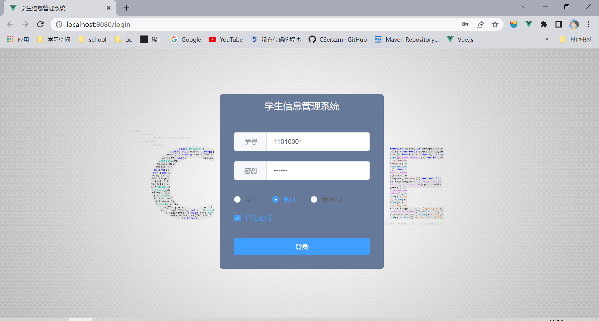
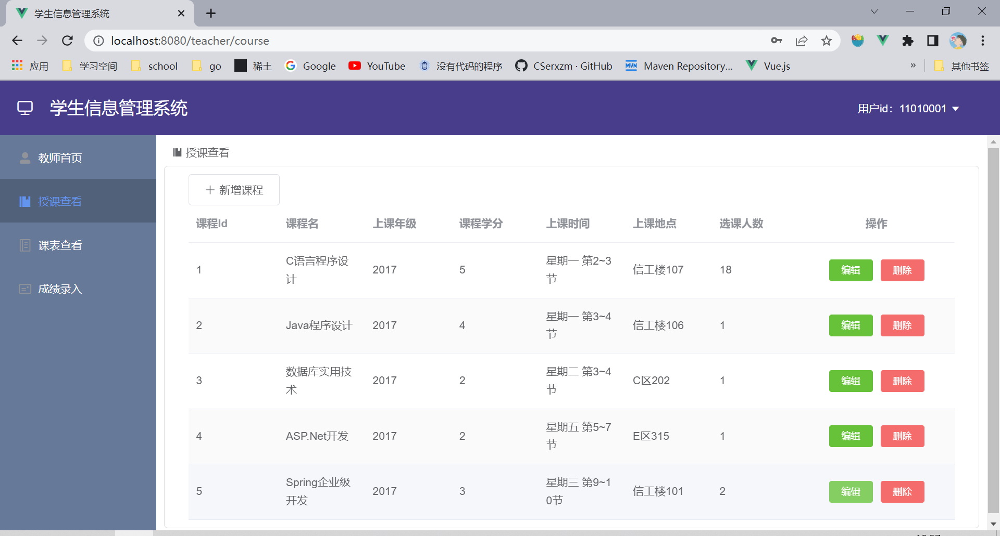
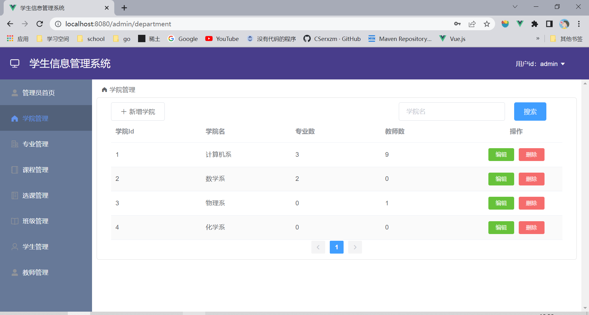
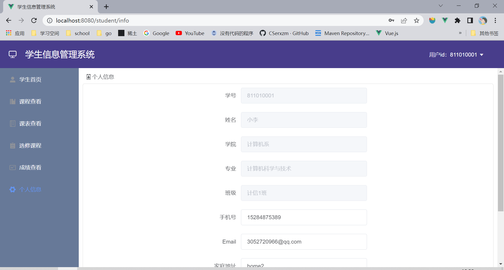

# 课程管理系统，可做相关毕设。
## course-front
* 前端代码，为Vue编写。
* UI组件使用ElementUI。
### 使用方式
* 切换到course-front文件夹
```bash
cd course-front
```
* 安装node依赖
```bash
npm install
```
* 启动前端代码
```
npm run serve
```
* 浏览器输入`http://localhost:8080/login`访问，访问的前提为后端运行成功。
* 输入账号密码，账号密码见文件夹course-server中sql子文件。
## course-server
* 后端代码，使用springboot+mybatis编写。
* 目前没使用redis，后期完善。
### 使用方式
* 创建数据库course，将`course-server/sql`文件中的数据库文件导入到本地数据库中。

* 修改数据库链接的账号和密码。
```yaml
server:
  port: 8085

spring:
  datasource:
    driver-class-name: com.mysql.jdbc.Driver
    url: jdbc:mysql://localhost:3306/course?useUnicode=true&characterEncoding=utf-8&serverTimezone=UTC
    username: root #数据库用户名
    password: password #数据库密码
  redis:
    host: localhost
    port: 6379
    username: root
    password: password
  jackson:
    time-zone: Asia/Shanghai

mybatis-plus:
  mapper-locations: classpath:mapping/*.xml
  type-aliases-package: com.xzm.course.model
```

* 使用IDEA打开工程，运行。

## 效果图









